# MusclesFit

## --> Introduccion <--

Esta Aplicación esta dedicada a los usuarios que suelen hacer actividad fisica. A lo largo de mi tiempo entrenando me he dado cuenta que cuando mas comienzas a avanzar
es cuando te pones a contar y dejar por escrito los ejercicios que haces, el peso que mueves, las medidas de tu cuerpo. Y tiene su logica, muchos bodybuilder y powerli
-fters suelen emplear este metodo, ya que asi es mas facil saber si estas entrenando de manera intensa, si necesitas cambiar tu entrenamiento porque estas estancado, y 
muchos otros beneficios, como conocer que ejercicios son tus puntos fuertes.

Esta aplicacion esta destinida a usuarios algo experimentados en el gimnasio o el mundo de la calistenia, ya que un usuario que recien ingrese a una de estas modalidades
tiene un gran camino que aprender hasta aprender todas las bases como para decidir que ejercicios hacer.

Proximamente me gustaria añadirle esas funcionalidades a esta aplicacion junto con una API para hacerlo mas dinamico y no depender de informacion en local. Ademas de que
el propio usuario pueda añadir imagenes de sus ejercicios y enriquezca la aplicacion.

### 1º: Estructura de la aplicacion.
La aplicacion consta de 4 modelos. El modelo principal "el diario", el modelo de ejercicios, el modelo de equipamiento y el modelo de las categorias.

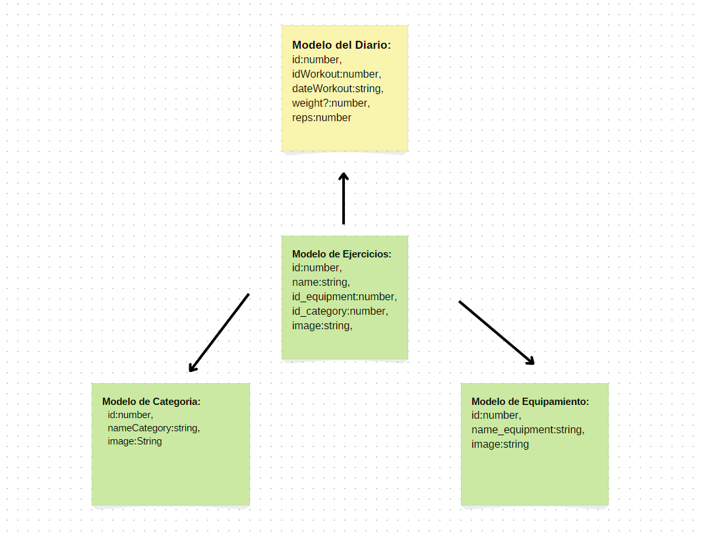

#### Estructura de paginas, componentes , servicios y Core.:
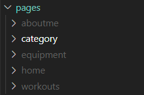
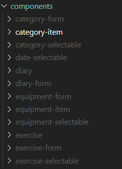
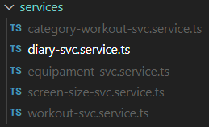
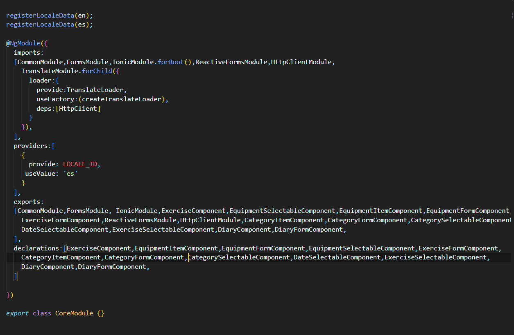

#### Servicio que cree para obtener el tamaño de la pantalla.
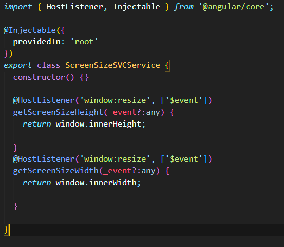

### 2º: Pagina Principal
La pagina principal tiene distintas vistas segun el disposito en el que estes ademas de implementar el diario de ejercicios.

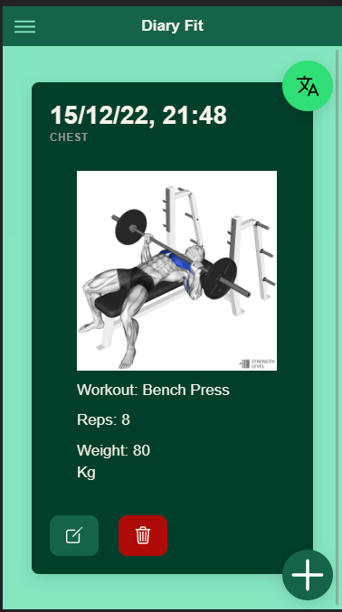
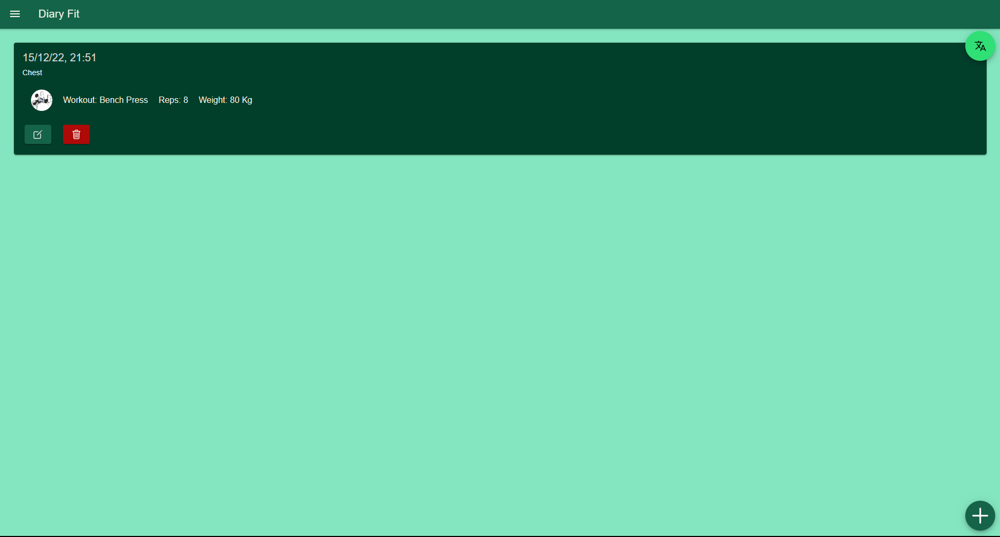

### 3º: Pagina Equipment
Esta pagina muestra un listado del equipo de gimnasio basico.
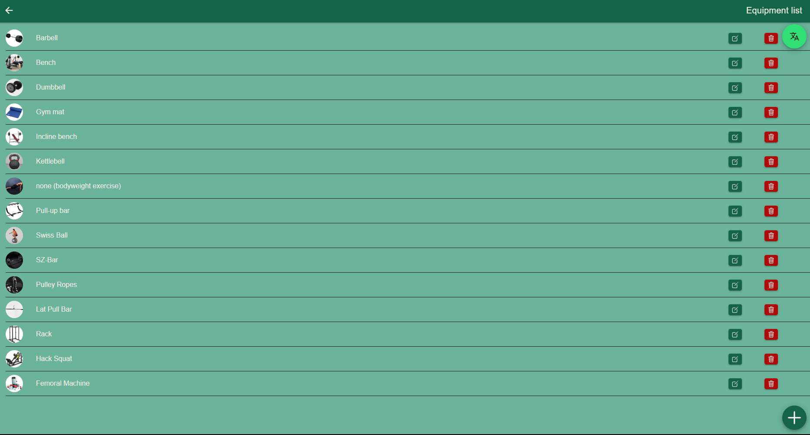

### 4º: Pagina Category
Esta pagina muestra las categorias en las que se clasificaran los ejercicios.
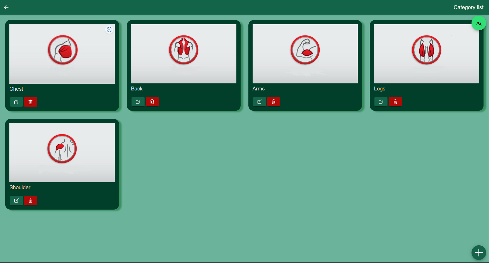

### 5º: Pagina Workout:
Esta pagina muestra los ejercicios que el usuario puede añadir al registro.
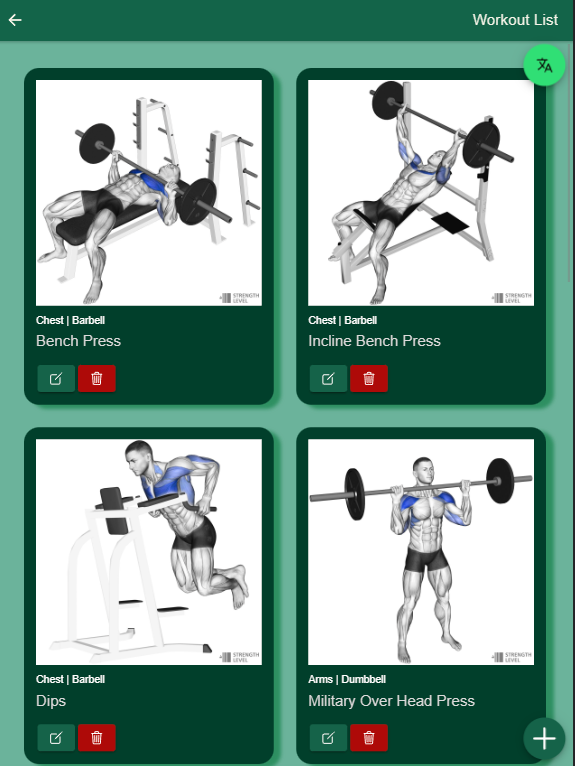

### 6º: Pagina About Me:
Esta pagina muestra informacion sobre el desarrollador (yo), Ademas gracias al servicio que cree para obtener el tamaño de la pantalla, he creado usando un ngContainer un formato para cada pantalla dependiendo de si estas en tablet, ordenador o movil.
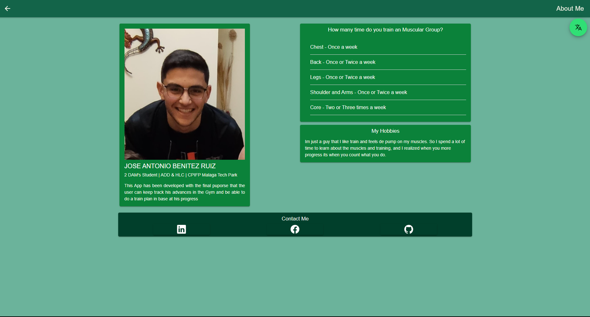
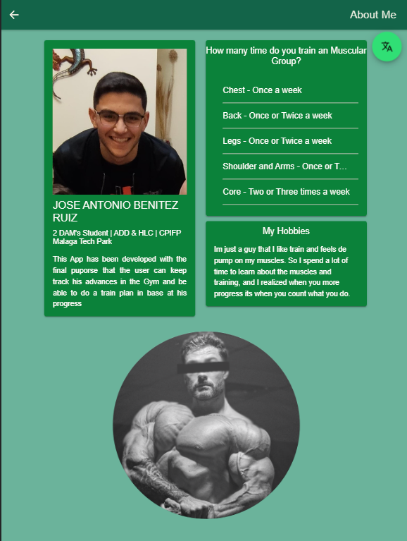
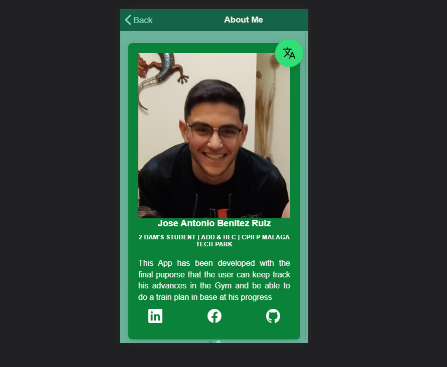

### 7º: Side Menu:
Para el side Menu tambien use el servicio (ScreenSize), para dependiendo el tipo de pantalla se desplegara de manera push o overlay
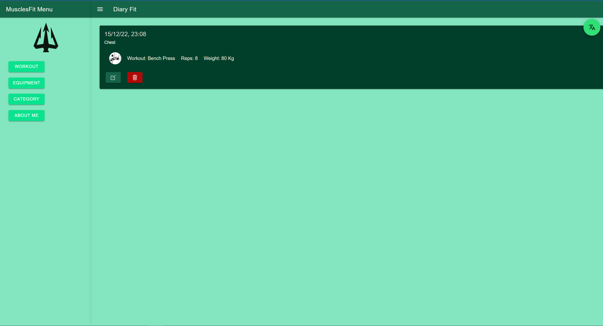
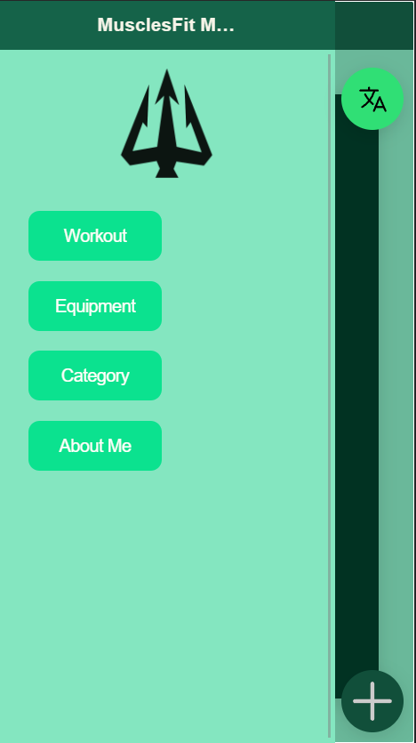

